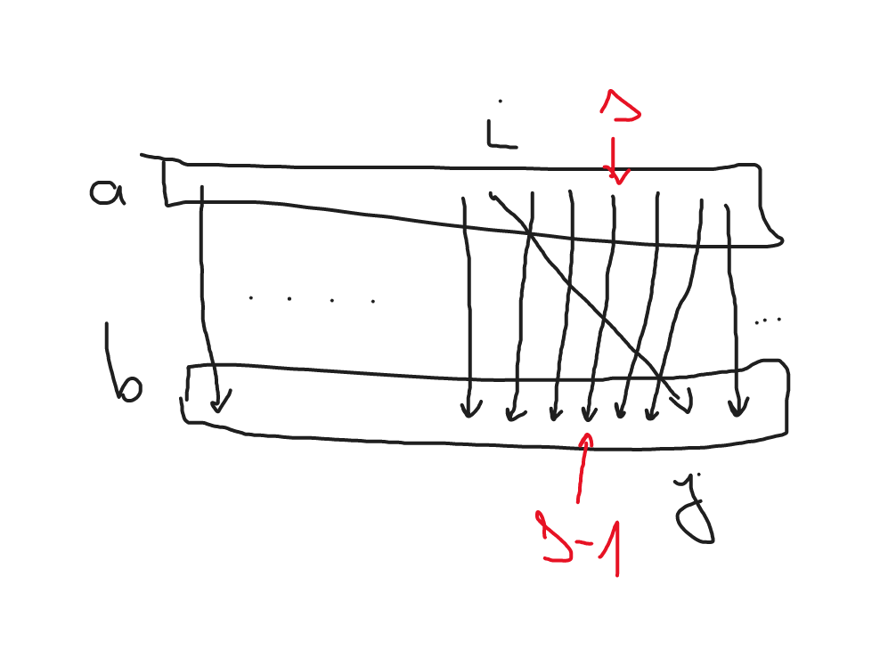
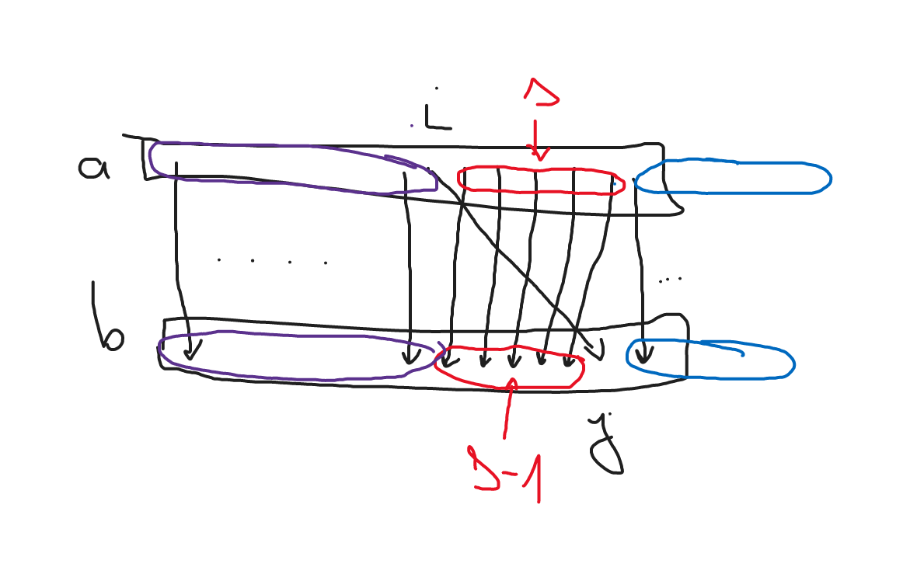

# 03 - Min-Max Array Transformation

https://codeforces.com/group/2cnVva0QXt/contest/399604/problem/03

- Ha az nem jó megoldás, hogy di = bi-ai, vagyis minden ai az ugyanolyan indexű bi-vel van párban, akkor a feladat nem is megoldható.
- Ha megoldható a feladat, akkor az a kérdés, hogy függetlenül egymástól a di változóknak mi a minimum és maximum értéke.
- Ezért kiindulunk abból a megoldásból, ahol dk = bk-ak minden k-re, majd egy adott ai-hez helyette egy korábbi bj-t rendelünk (j<i).
- Ameddig bj-ai>=0 addig a megoldás befejezhető: egyszerűen az aj-hez meg a bi-t rendeljük hozzá, a többiek maradnak. Itt látszik, hogy aj < ai < bi, tehát ez jó megoldás lesz.
- Itt ez még működik, de a maximális lehetséges érték keresésénél már nem fog.
- Itt mindenki mást eggyel kell leshiftelni. Annyira messzire tudjuk az ai párját helyezni ameddig még ez a shiftelés nem romlik el (nem lesz negatív a különbség).
- Kb érvelés:
  - Tegyük fel, hogy a[i]-t párba állíthatjuk b[j]-vel (befejezhető ez a megoldás), de mégis közben van egy a[s] és b[s-1] pár ahol a[s] > b[s-1], tehát nem párba állíthatók.
  - Ekkor a b[s-1]-nek ki legyen a párja? Ha a[s]-től balra keresünk neki párt, pl a[l] l<s-t, akkor az egy ugyanilyen problémát fog okozni, b[l]-nek nem lesz párja. Hiába cseréljük kisebbre, csak görgetjük magunk előtt a hibát.
  - a[s]-től jobbra pedig csak növekednek az a értékek, tehát csak rosszabb lesz a helyzet.

- Kb érvelés 2:
  - Az a tömbben piros halmaz darabnyi elemet kell az i-j átló bal oldalára / "eggyel hátrébb" behúzni, tehát ha a piros halmazon belül van egy túl nagy különbség "hátra", az valamelyik behúzásban benne lesz, tehát túl nagy lesz a különbség "hátra" = negatív lesz.

- Ugyanez a kötözgetés előre irányban is működik egyébként, de ott egyszerűbb a helyzet.

## Implementációk

- https://codeforces.com/contest/1721/submission/172032690
  - Más logika a hátrafelé menéshez.

- https://codeforces.com/contest/1721/submission/171672377
  - Ez a mienk.

- https://codeforces.com/contest/1721/submission/170864312
  - Lol komment. :)

- https://codeforces.com/contest/1721/submission/169877236
- https://codeforces.com/contest/1721/submission/170001390
- https://codeforces.com/contest/1721/submission/169825908
