# Folyamok

## Hálózat és folyam

### Példák

Amikre ez a modell passzol:

- Úthálózat, amin termékeket szállítanak.
- Csatornahálózat, amiben folyik a víz.
- Elektromos hálózat, amin áram folyik (lásd Kirchhoff-törvények).
- Internet, amin információ áramlik.
- Advanced: Nem áramlik semmi, lokális kapcsolatokat/kényszereket modellezünk vele. Pl. 10-es feladat.

### Hálózat

$G(V,E)$ irányított (nem-negatív) élsúlyozott gráf.

- Az élsúlyok kapacitásokat jelölnek: $c: E \rightarrow \mathbb{R}_{\geq{}0}$ kapacitásfüggvény.
- Kitüntetett csúcsok:
  - Source $s\in{}V$: Kiindulópont (termelő), csak kiélei vannak.
  - Target $t\in{}V$: Végállomás (fogyasztó), csak beélei vannak.
- Közbenső csúcs: többiek.

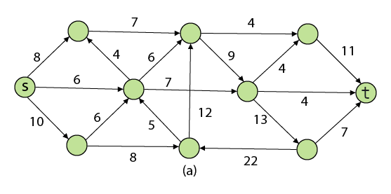

### Folyam

Élekhez számok (folyamértékek) hozzárendelése $f: E \rightarrow \mathbb{R}_{\geq{}0}$ folyamfüggvény.

Úgy hogy:

- Nem-negatív és a kapacitásnál nem több: $\forall{}e\in{}E$  

$$0\leq{} f(e) \leq{}c(e)$$

- Közbenső csúcsba ami befolyik az kifolyik: $\forall{}v\in{}V \setminus{} \\{s,t\\}$  

$$\sum\limits_{\forall{}\xrightarrow{e}v} f(e) = \sum\limits_{\forall{}\xleftarrow{e}v} f(e)$$

- A source-ból az folyik ki ami a targetbe befolyik:

$$ \sum\limits_{\forall{}\xleftarrow{e}s} f(e) = \sum\limits_{\forall{}\xrightarrow{e}t} f(e) $$

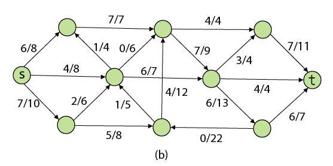

### Folyam értéke

Amennyi "dolog" "átment" a source-ból a target-ba.

- Leolvasható: Source-ból kimenő VAGY target-be befutó élek folyamértékeinek összege.

## Feladatok

### Maximális folyam

Mekkora a rendszeren átvihető legnagyobb "mennyiség"?

### Minimális vágás

- Melyik (legkisebb kapacitásösszegű) éleket kell törölni, hogy a rendszeren ne lehessen semmit átvinni?
- Ha ezeket az éleket kitöröljük, akkor a gráf kettéesik: egy source-t tartalmazó csúcshalmazra és egy target-et tartalmazó csúcshalmazra.
- Nem lesz átjárás a source-ből a target felé.
- Vágás = source csúcshalmaza.
- Vágás kapactása = source csúcshalmazából kimutató élek kapacitásainak az összege.

## Tételek

### Maximális folyam = minimális vágás tétel

"Bottleneck": A maximális folyam értéke egyezik a minimális vágás kapacitásával.

## Algoritmusok

### Ford-Fulkerson "módszer"

- Kiindulunk a csupa 0 folyamból.
- Útvonalat keresünk a source-ból a targetbe.
- Útvonal mentén megkeressük a legkisebb kapacitást.
- Annyival növeljük a folyam értékét az útvonal minden élén.
- Ezt addig csináljuk amíg van S-T út.
- Az alábbi példán ezt megnézzük és megmutatom, hogy a maradék hálózat mire jó.

Csupa 0 folyam:  
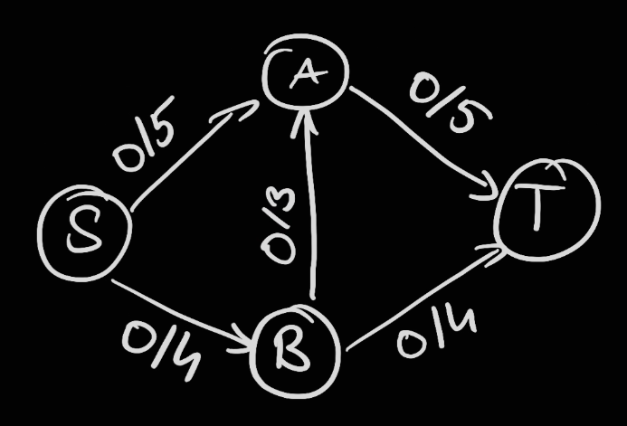

S-t útvonal, amin a bottleneck a B->A, 3-mas kapacitású él:  
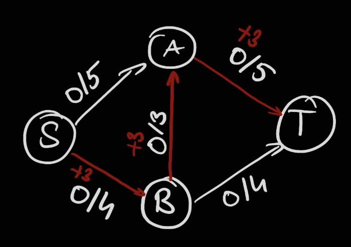

Bővítjük a folyamot az élek mentén 3-mal:  
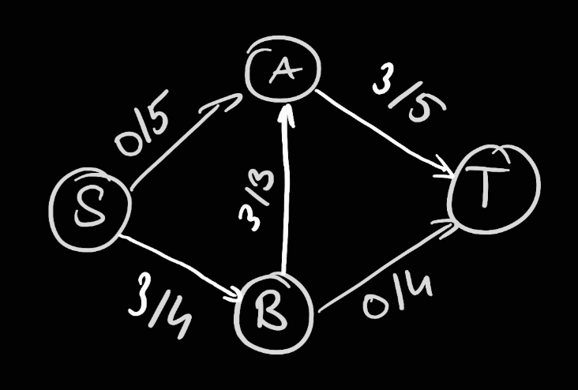

S-t útvonal, amin a bottleneck a maradék 2 kapacitás az A-T élen:  
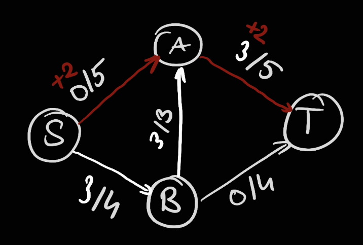

Bővítjük a folyamot az élek mentén 2-vel:  
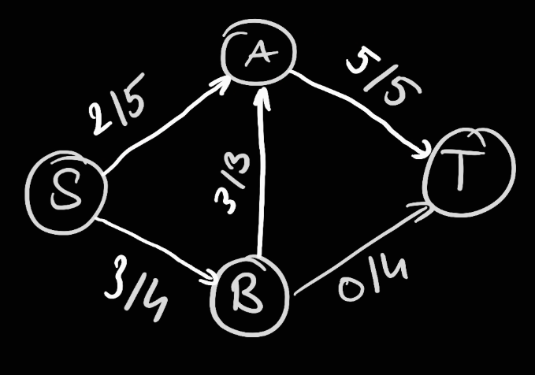

S-t útvonal, amin a bottleneck a maradék 1 kapacitás az S-B élen:  
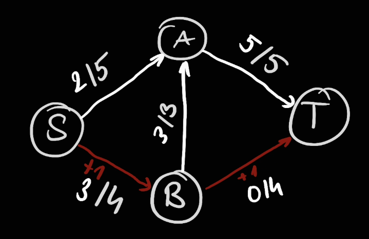

Bővítjük a folyamot az élek mentén 1-el:  
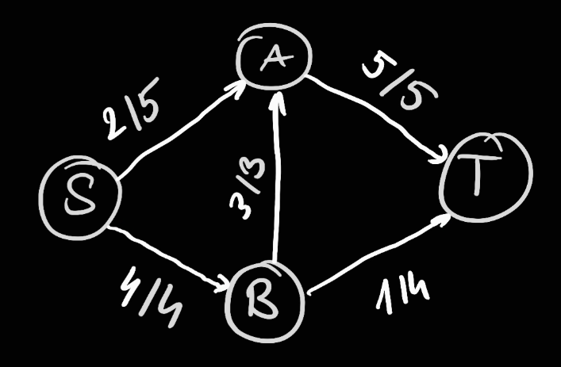

Probléma:  
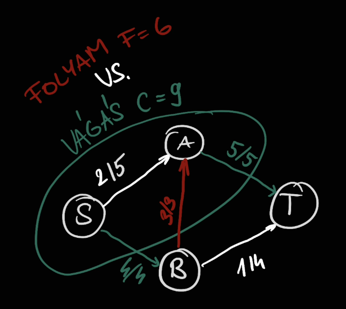

- A vágás 9, a folyam 6. Még nem vagyunk kész, de már nincs út.
- Probléma: a piros élet "elrontottuk", hibás döntés volt azt használni.
- Megoldás: vissza kellene vonni a felhasználást.
- Hogyan: minden felhasznált kapacitáshoz vegyünk fel ekkora kapacitású visszaélet.
  - Ezt az útonalkeresés megtalálhatja és azon bővítve a folyamot visszavonhtja a korábbi döntést (csökkentheti a felhasznált kapacitást).

Lila élek: annyi kapacitással amennyit az eredeti folyam elhasznált.  
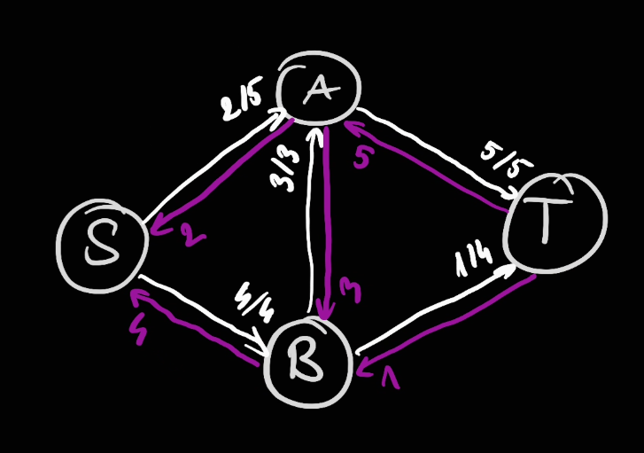

Ezen a ponton a fehér éleken elég a "maradék" kapacitásokat tárolni, az eddigi f/c számok helyett a c-f értéket:  
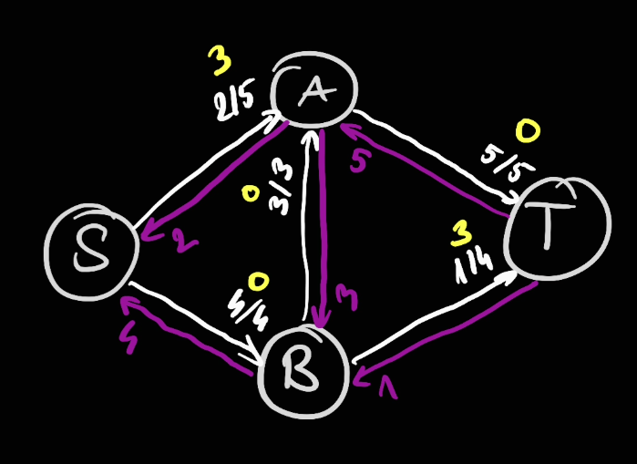

Sárga élek: mennyi kapacitást lehet még elhasználni.  
Lila élek: mennyi elhasznált kapacitást lehet visszavonni.  
= Minden lehetséges változtatás az aktuális folyamunkon!
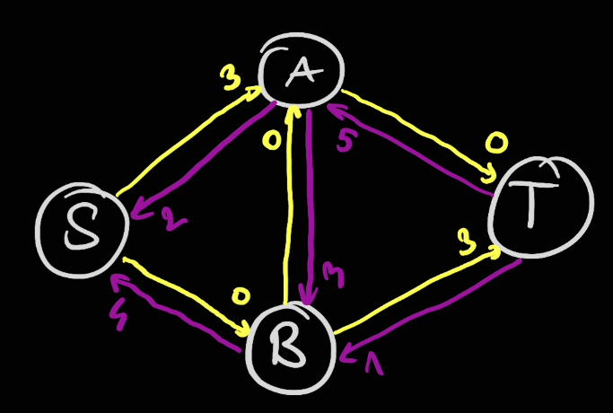

Az átláthatóság kedvéért a 0 kapacitású éleket ne ábrázoljuk:  
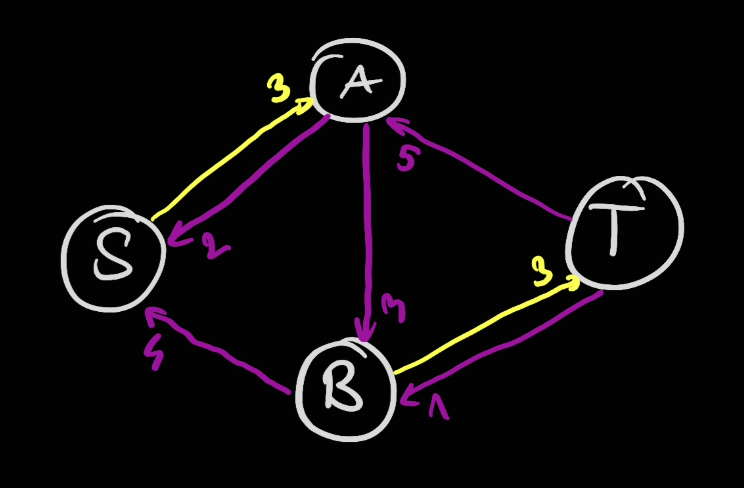

Ekkor már látszik is az új javító út, ami a B-A élet visszavonja:  
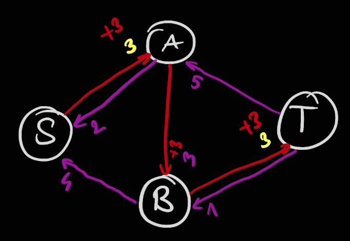

Frissítjük a maradék hálózatot:  
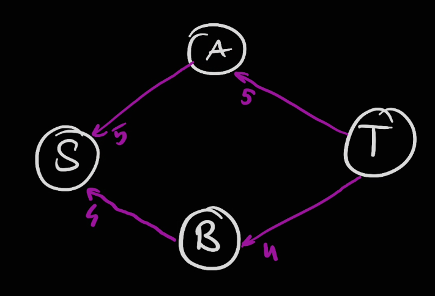

Vágás kapacitása = folyam értéke. Készen vagyunk, nincs S-T út.  
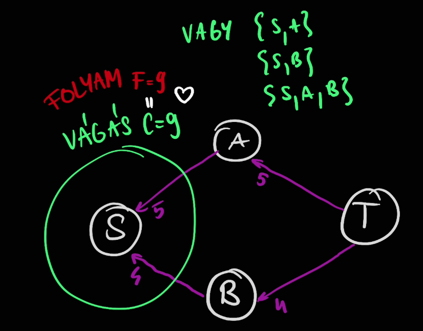

https://youtu.be/LdOnanfc5TM

### Edmonds-Karp

- A Ford-Fulkerson módszer nem specifikálja hogyan keressük a javító utat.
- Kereshetjük például: DFS, BFS, Dijkstra, stb.
- DFS: Túl hosszú utakat talál, amin valószínű, hogy csak 1-el tudunk javítani. Emiatt $O(fE)$ a futásideje, ahol $f$ a max folyamérték.
- BFS: Edmonds-Karp
- $O(VE^2)$

https://youtu.be/RppuJYwlcI8

### Dinic

- $O(V^2E)$.
  - Speciális esetek:
    - Páros gráfokon $O(\sqrt{V}E)$, [lásd Hopcroft–Karp](https://en.wikipedia.org/wiki/Hopcroft%E2%80%93Karp_algorithm).
    - Ha minden élkapacitás 1, akkor $O(min(V^{\frac{2}{3}}, E^{\frac{1}{2}})E)$.
- Ugyanúgy a maradék hálózaton keres javító utat, de azt ügyesebben.
- Egy BFS + DFS kombinációt használ, ami ordóban gyorsabbra jön ki.

- 1. fázis: BFS
  - A maradék gráfon futtat egy BFS-t és felcímkézi a csúcsokat az alapján hogy milyen távol vannak a source-tól. = Level graph (szint gráf?)
  - Csak azokat az éleket hagyja meg ahol a szintkülönbség pont 1. Tehát:
    - Nincs visszaél kisebb szintre.
    - Nincs keresztél azonos szinten belül.
    - Egynél nagyobb szintkülönbségű előreél nem lehet, mert akkor a BFS-nek hamarabb meg kellett volna találnia az él végét.
- 2. fázis: DFS-ek
  - A szintgráfon keres javítóutat DFS-el amíg talál.
  - Ha egy DFS "dead end"-be ütközik, akkor kifele jövetel közben (DFS bakctrackje) felcímkézi a csúcsokat hogy oda legközelebb már ne menjünk be.
    - A rekurzív hívás végén az adott csúcsra megnézi hogy van-e nem blokkolt szomszédja. Ha nincs akkor blokkolt a csúcs is.
  - Blokkolt csúcsokba következő DFS már nem megy be.

Ezt ismételgeti amíg a BFS-el elérhető a source-ból a target.

https://youtu.be/M6cm8UeeziI  
https://codeforces.com/blog/entry/104960

## Megjegyzések

### EgÉr lemma

- Egészértékűségi lemma.
- Ha a hálózatban minden kapacitás egész, akkor van olyan maximális folyam ami minden élen egész értékű.
- A javítóutas algoritmus ilyet fog találni.

### Maximális párosítás keresése folyammal

A páros gráfban maximális párosítás keresése feladat:  
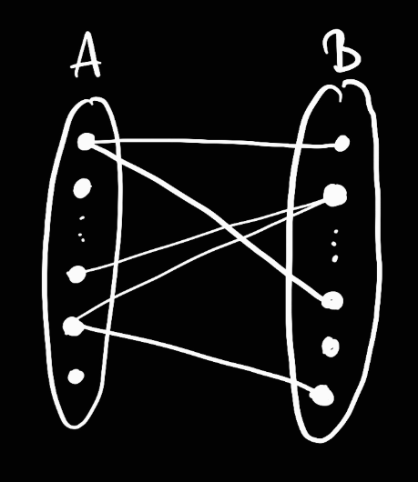

Is megoldható folyammal:  
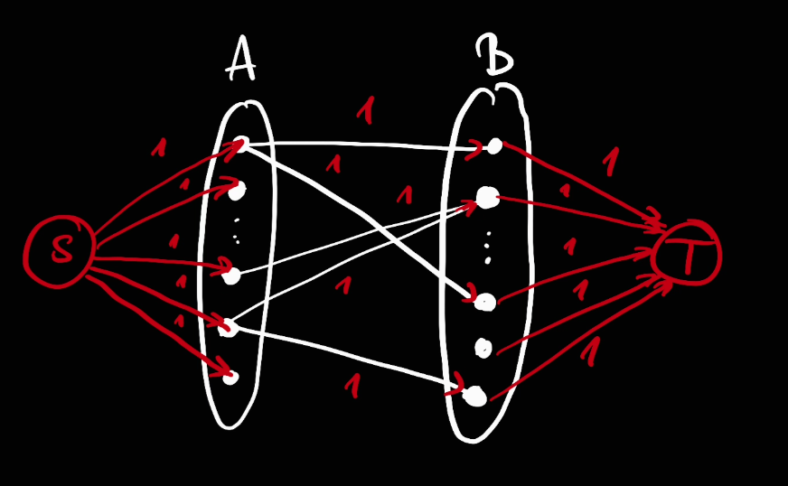

- Felveszünk +2 csúcsot, 1 source és 1 target.
- Source-ból bekötünk minden A-beli csúcsot 1 kapacitással.
- Target-ba bekötünk minden B-beli csúcsot 1 kapacitással.
- A->B irányban megirányítjuk a közbenső éleket 1 kapacitással.
- Max folyam = max párosítás.

## Általánosítás

### Irányítatlan gráfok

- Irányítsuk meg mindkét irányba az összes élet és írjuk mindkét példányra az eredeti él kapacitását.
- A maximális folyam úgyis csak az egyik irányt fogja használni, hiszen ha mindkettőt használja az helyettesíthető a különbséggel a nagyobbik irányba.
- A minimális vágáshoz csak az egyik irányú élet kell kivenni. A kivett él kezdőpontja a source oldalán lesz, a végpontja a target oldalán.

### Csúcskapacitások

- "Húzzuk szét" őket élekre.
- Mindegyik csúcsot 2 csúccsal és egy irányított éllel helyettesítünk.
- Az egyik új csúcs megkapja az eredeti beéleit, ebből mutat a másik csúcsba az új él, ami megkapja az eredeti kiéleit.

### Több source/target

- Vegyünk fel egy új "master source" és "master target" csúcsot.
- Végtelen kapacitásokkal vegyünk fel kiéleket a "master source"-ból az eredetiek felé.
- Végtelen kapacitásokkal vegyünk fel beéleket a "master target"-be az eredetiek felől.

## Feladatok:
- https://codeforces.com/problemset/problem/653/D
