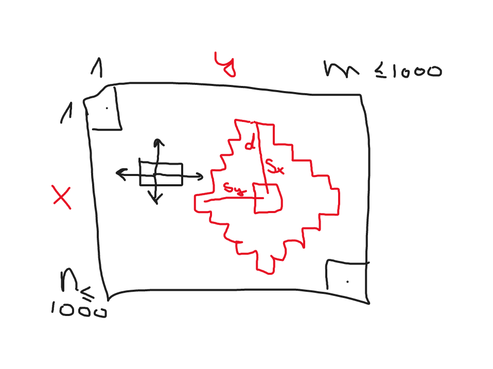

# 1721 B

- Legegyszerűbb a falak mellett elmenni: felső + jobb vagy bal + alsó fal.
- Mikor nem lehet így? > Ha mindkét útvonal blokkolva van.
- Mikor van mindkét útvonal blokkolva? Alábbi 4 eset valamelyike:
  - Felső + alsó fal blokkolva: Függőleges elválasztó. > Egyáltalán nincs megoldás.
  - Felső + bal fal blokkolva: Kezdőpont lezárva. (Am ez az eset ki van zárva a feladat szövege szerint.)
  - Alsó + jobb fal blokkolva: Végpont lezárva. > Egyáltalán nincs megoldás.
  - Bal + jobb fal blokkolva: Víszintes elválasztó. > Egyáltalán nincs megoldás.

Tehát vagy a fenti 4 eset egyike van és nem megoldható, vagy a falak mellett elmenve n+m-2 lépéssel megoldható.
